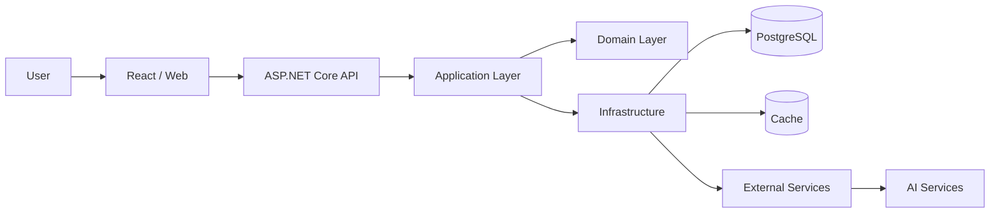

# Matheus Rodrigues 

### Software Developer • Backend Engineering • .NET Ecosystem

 

---

## 👨‍💻 Sobre mim

Sou desenvolvedor de software com foco na construção de **aplicações web, APIs e soluções escaláveis**, atuando principalmente com **.NET** e tecnologias do ecossistema moderno de desenvolvimento.

Busco evoluir de forma contínua, tanto em **competências técnicas (hard skills)** quanto em **habilidades interpessoais (soft skills)**, sempre com o objetivo de me tornar um profissional melhor a cada dia.

Encaro novas tecnologias, ferramentas e desafios como oportunidades de aprendizado e crescimento. Acredito que a tecnologia, quando aplicada com **propósito, criatividade e responsabilidade**, possui um enorme potencial para transformar processos, solucionar problemas e gerar impacto positivo na sociedade.

---

## 🚀 Atualmente

- 💻 Desenvolvendo aplicações utilizando **.NET, React e PostgreSQL**
- 🏗️ Aprofundando conhecimentos em **Software Architecture, DDD e Clean Architecture**
- ⚡ Estudando **performance, escalabilidade e sistemas distribuídos**
- 🤖 Explorando a integração de **Inteligência Artificial em aplicações reais**
- ☁️ Expandindo conhecimentos em **Docker, Linux e Cloud Computing**
- 🧪 Aprimorando práticas relacionadas a **testes, qualidade de software e observabilidade**
- 📚 Buscando evolução constante em **hard skills e soft skills**

---

## 🧭 Engineering Focus

`Backend Engineering` • `Software Architecture` • `REST APIs`

`Distributed Systems` • `Database Design` • `Cloud`

`DevOps` • `Artificial Intelligence` • `Software Performance`

---

## 🛠️ Tech Stack

### ⚙️ Backend

  

### 🎨 Frontend

  

### 🗄️ Data

  

### ☁️ DevOps & Cloud

  

---

<!-- ## 🚀 Projetos em Destaque -->

<!-- ### ⚙️ Projeto 01 — Nome do Projeto

Aplicação desenvolvida para **resolver um problema específico**, estruturada com foco em manutenibilidade, organização arquitetural e possibilidade de crescimento.

**Principais pontos:**

- Arquitetura organizada e modular
- Desenvolvimento de APIs REST
- Autenticação e autorização
- Modelagem e persistência de dados
- Integração entre frontend e backend
- Tratamento de erros e validações

**Stack**

`C#` `.NET` `React` `PostgreSQL` `Docker`

[🔗 Repositório](LINK_DO_REPOSITORIO) • [🌐 Demo](LINK_DA_APLICACAO)

-->

## 🏗️ Software Architecture

Uma representação simplificada de como busco estruturar aplicações modernas:

Busco desenvolver aplicações priorizando:

- **Separation of Concerns**
- **Clean Code**
- **SOLID**
- **Domain-Driven Design**
- **Testability**
- **Observability**
- **Security by Design**
- **Performance & Scalability**

---

## 🧠 Princípios de Desenvolvimento

> Código não deve apenas funcionar hoje. Ele deve continuar compreensível, sustentável e preparado para evoluir amanhã.

Procuro desenvolver soluções considerando não apenas a implementação imediata, mas também aspectos como **manutenção, segurança, desempenho, escalabilidade e clareza arquitetural**.

---

## 📊 GitHub

  

---

## 📚 Estudos & Aprendizado

<strong>🏗️ Software Engineering & Architecture</strong>

 

- Software Architecture
- Clean Architecture
- Domain-Driven Design
- Design Patterns
- SOLID
- Clean Code
- Modular Architecture
- Distributed Systems
- Microservices

<strong>⚙️ Backend Engineering</strong>

 

- ASP.NET Core
- REST APIs
- Authentication & Authorization
- Background Processing
- Asynchronous Programming
- Caching
- API Design
- API Security
- Performance Optimization

<strong>🗄️ Data & Persistence</strong>

 

- PostgreSQL
- SQL
- Data Modeling
- Entity Framework Core
- Query Optimization
- Database Performance
- Data Architecture

<strong>☁️ Infrastructure & DevOps</strong>

 

- Docker
- Linux
- Cloud Computing
- Microsoft Azure
- CI/CD
- GitHub Actions
- Observability
- Application Monitoring

<strong>🤖 Artificial Intelligence</strong>

 

- Generative AI
- LLM Integration
- AI APIs
- Tool Calling
- AI Agents
- AI-assisted Software Development
- Intelligent Automation

---

## 🎯 Objetivos

Continuar evoluindo como desenvolvedor e aprofundar conhecimentos relacionados à **engenharia e arquitetura de software**, buscando construir sistemas cada vez mais robustos, seguros, escaláveis e preparados para problemas reais.

Meu objetivo não é apenas aprender novas tecnologias, mas compreender **quando, como e por que utilizá-las**.

---

## 🤝 Contato

 

---

### `Learn. Build. Improve. Repeat.`

Software é mais do que escrever código — é transformar problemas em soluções.

